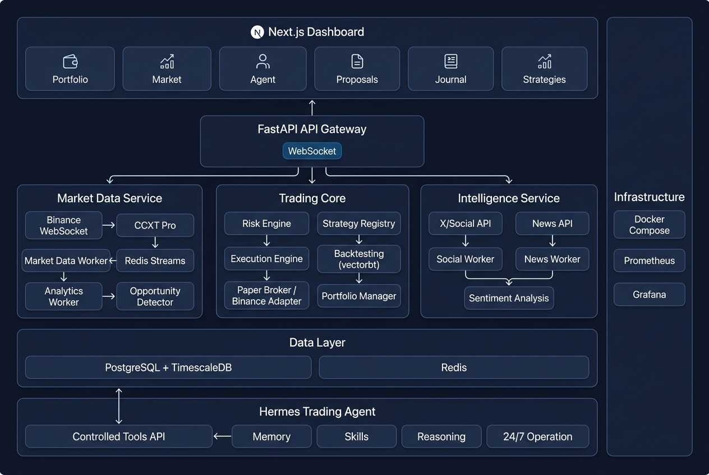

# AI Trading Intelligence Platform — MVP Goal Architecture

**Status:** Approved  
**Date:** August 13, 2026  
**PRD Reference:** [prd.md](prd.md)  

---

## System Architecture



---

## Architecture Overview

The platform is a private, single-user AI trading system built as a layered service architecture. Each layer depends only on the layers below it. The Hermes Trading Agent sits outside the core platform and accesses it exclusively through controlled tool APIs.

```text
┌─────────────────────────────────────────────────────────────────────┐
│                       PRESENTATION LAYER                            │
│                                                                     │
│  Next.js Dashboard                                                  │
│  ┌──────────┬──────────┬──────────┬──────────┬──────────┬────────┐ │
│  │Portfolio │ Market   │ Agent    │Proposals │ Journal  │Strategy│ │
│  │Overview  │ View     │ View     │  View    │  View    │Analytics│ │
│  └──────────┴──────────┴──────────┴──────────┴──────────┴────────┘ │
│                              │                                      │
│                    REST + WebSocket                                  │
└──────────────────────────────┼──────────────────────────────────────┘
                               │
┌──────────────────────────────┼──────────────────────────────────────┐
│                       API GATEWAY LAYER                              │
│                                                                     │
│  FastAPI                                                            │
│  ┌─────────────────────────────────────────────────────────────┐   │
│  │ /api/v1/markets  /analytics  /strategies  /backtests        │   │
│  │ /api/v1/portfolio  /proposals  /risk  /orders  /trades      │   │
│  │ /api/v1/agent  /opportunities  /intelligence  /system       │   │
│  │ WebSocket: prices, signals, proposals, agent activity       │   │
│  │ Hermes Tool Endpoints (service auth)                        │   │
│  └─────────────────────────────────────────────────────────────┘   │
└──────────────────────────────┼──────────────────────────────────────┘
                               │
┌──────────────────────────────┼──────────────────────────────────────┐
│                       SERVICE LAYER                                  │
│                                                                     │
│  ┌──────────────────┐ ┌──────────────────┐ ┌──────────────────┐   │
│  │  MARKET DATA     │ │  TRADING CORE    │ │  INTELLIGENCE    │   │
│  │                  │ │                  │ │                  │   │
│  │  CCXT Pro WS     │ │  Risk Engine     │ │  X/Social API    │   │
│  │  Market Worker   │ │  Execution Engine│ │  Social Worker   │   │
│  │  Analytics Worker│ │  Paper Broker    │ │  News API        │   │
│  │  Opportunity     │ │  Binance Adapter │ │  News Worker     │   │
│  │    Detector      │ │  Strategy        │ │  Sentiment       │   │
│  │  Backfill Manager│ │    Registry      │ │  Event           │   │
│  │                  │ │  Backtesting     │ │    Correlation   │   │
│  │                  │ │    (vectorbt)    │ │                  │   │
│  │                  │ │  Portfolio Mgr   │ │                  │   │
│  └──────────────────┘ └──────────────────┘ └──────────────────┘   │
└──────────────────────────────┼──────────────────────────────────────┘
                               │
┌──────────────────────────────┼──────────────────────────────────────┐
│                       DATA LAYER                                     │
│                                                                     │
│  ┌──────────────────────────┐  ┌──────────────────────────────┐   │
│  │  PostgreSQL + TimescaleDB│  │  Redis                       │   │
│  │                          │  │                               │   │
│  │  Hypertables:            │  │  Streams:                     │   │
│  │   market_candles         │  │   market:ticker:{symbol}      │   │
│  │   market_trades          │  │   market:candle:{symbol}:{tf} │   │
│  │   market_ticker_snapshots│  │   market:trade:{symbol}       │   │
│  │   indicator_snapshots    │  │   market:orderbook:{symbol}   │   │
│  │   signal_events          │  │   signal:{type}               │   │
│  │   social_metrics         │  │   opportunity:{symbol}        │   │
│  │   portfolio_snapshots    │  │                               │   │
│  │                          │  │  Live State:                  │   │
│  │  Tables:                 │  │   Order book (in-memory)      │   │
│  │   strategies             │  │   Current regime              │   │
│  │   strategy_versions      │  │   Session caches              │   │
│  │   backtests              │  │                               │   │
│  │   trade_proposals        │  │                               │   │
│  │   orders / executions    │  │                               │   │
│  │   positions              │  │                               │   │
│  │   agent_decisions        │  │                               │   │
│  │   risk_rules             │  │                               │   │
│  └──────────────────────────┘  └──────────────────────────────┘   │
└──────────────────────────────┼──────────────────────────────────────┘
                               │
┌──────────────────────────────┼──────────────────────────────────────┐
│                       AGENT LAYER                                    │
│                                                                     │
│  ┌─────────────────────────────────────────────────────────────┐   │
│  │  Hermes Trading Agent (isolated profile)                    │   │
│  │                                                             │   │
│  │  Memory ─── Trading episodic + quantitative (via tools)     │   │
│  │  Skills ─── Trading skills (breakout, trend, risk, etc.)    │   │
│  │  Tools  ─── market.*, analytics.*, strategy.*, portfolio.*  │   │
│  │             proposal.*, memory.*, research.*                │   │
│  │  Model  ─── LLM Gateway → model router                     │   │
│  │  Mode   ─── 24/7 continuous operation                       │   │
│  │                                                             │   │
│  │  ⚠ NO direct Binance credentials                           │   │
│  │  ⚠ NO risk limit modification                              │   │
│  │  ⚠ NO autonomous live execution (MVP 1)                    │   │
│  └─────────────────────────────────────────────────────────────┘   │
└────────────────────────────────────────────────────────────────────┘

┌────────────────────────────────────────────────────────────────────┐
│                       INFRASTRUCTURE                                │
│                                                                     │
│  Docker Compose │ Prometheus │ Grafana │ Caddy/Nginx │ systemd     │
└────────────────────────────────────────────────────────────────────┘
```

---

## Data Flow: Opportunity → Trade

```text
    Binance WebSocket
         │
         ▼
  ┌─────────────┐
  │ Market Data  │──────────────────────────────────┐
  │ Worker       │                                   │
  └──────┬──────┘                                   │
         │                                           │
         ▼                                           ▼
  Redis Streams                              TimescaleDB
         │                                   (historical)
         ▼
  ┌─────────────┐     ┌─────────────┐
  │ Analytics   │────→│ Opportunity │
  │ Worker      │     │ Detector    │
  │ (indicators,│     │ (scans for  │
  │  regime)    │     │  setups)    │
  └─────────────┘     └──────┬──────┘
                              │
                    Candidate Event
                              │
                              ▼
                    ┌─────────────────┐
                    │  Hermes Agent   │
                    │                 │
                    │  1. Get context │
                    │  2. Load skill  │
                    │  3. Research    │
                    │  4. Check history│
                    │  5. Evaluate    │
                    └────────┬────────┘
                             │
                    Trade Proposal
                             │
                             ▼
                    ┌─────────────────┐
                    │  Risk Engine    │
                    │  (deterministic)│
                    └────────┬────────┘
                             │
                        ┌────┼────┐
                        │         │
                     PASS       REJECT
                        │
                        ▼
                    ┌─────────────┐
                    │   Owner     │
                    │  Dashboard  │
                    │             │
                    │ [APPROVE]   │
                    │ [REJECT]    │
                    │ [WATCH]     │
                    └──────┬──────┘
                           │
                        APPROVE
                           │
                           ▼
                    ┌─────────────────┐
                    │ Execution Engine│
                    │                 │
                    │  Paper Broker   │
                    │       or        │
                    │  CCXT → Binance │
                    └────────┬────────┘
                             │
                     Position Created
                             │
                             ▼
                    ┌─────────────────┐
                    │ Position Monitor│
                    │ → Stop/Target   │
                    │ → Close         │
                    │ → P&L calc      │
                    │ → Journal entry │
                    └────────┬────────┘
                             │
                     Trade Complete
                             │
                             ▼
                    ┌─────────────────┐
                    │ Agent evaluates │
                    │ outcome, stores │
                    │ observations    │
                    └─────────────────┘
```

---

## Implementation Slices

Each slice builds on the previous one. Each produces a testable, runnable subsystem.

```text
                    ┌─────────────────────┐
               10   │  Tiny Live Trading  │  Gate 5
                    └────────┬────────────┘
                    ┌────────┴────────────┐
                9   │    Dashboard UI     │
                    └────────┬────────────┘
                    ┌────────┴────────────┐
                8   │  Paper Trading E2E  │  Gate 4
                    └────────┬────────────┘
                    ┌────────┴────────────┐
                7   │    Main Agent       │  Gate 3
                    │  (Hermes + Tools)   │
                    └────────┬────────────┘
                    ┌────────┴────────────┐
                6   │  Hermes Trading     │
                    │  Tools (MCP/API)    │
                    └────────┬────────────┘
                    ┌────────┴────────────┐
                5   │  Opportunity        │
                    │  Detection Engine   │
                    └────────┬────────────┘
                    ┌────────┴────────────┐
                4   │  Backtesting +      │  Gate 2
                    │  Strategy Registry  │
                    └────────┬────────────┘
                    ┌────────┴────────────┐
                3   │  Risk Engine +      │
                    │  Execution Engine   │
                    └────────┬────────────┘
                    ┌────────┴────────────┐
                2   │  Portfolio +        │  Gate 1
                    │  Analytics Engine   │
                    └────────┬────────────┘
                    ┌────────┴────────────┐
                1   │  Market Data +      │  ◄── YOU ARE HERE
                    │  Storage            │
                    └─────────────────────┘
```

---

### Slice 1: Market Data + Storage ← CURRENT

**What it builds:** Binance WebSocket → CCXT Pro → Redis Streams → TimescaleDB

**Components:**
- Market Data Worker (CCXT Pro subscriptions for BTC/USDT, ETH/USDT)
- Redis Stream publisher + consumer infrastructure
- TimescaleDB hypertables (candles, trades, ticker snapshots)
- Persistence Worker (Redis → batched DB writes)
- Health monitoring + backfill on startup
- Structured logging, Docker Compose (TimescaleDB + Redis)

**Produces:** Reliable, continuous market data flowing from Binance into persistent storage.

**Gate:** Market data reliable ✓

**Design spec:** [2026-08-13-market-data-storage-design.md](../superpowers/specs/2026-08-13-market-data-storage-design.md)  
**Implementation plan:** to be written when Foundation 2 starts. The earlier plan was removed because it assumed a `src/trading/` layout that predates the approved PRD section 82 layout. Reconcile the design spec to that layout before replanning.

---

### Slice 2: Portfolio Accounting + Analytics Engine

**What it builds:** Deterministic quantitative analytics and portfolio state tracking.

**Components:**
- Analytics Worker (consumes candle/trade streams from Redis)
- Technical indicators via TA-Lib (RSI, MACD, MAs, ATR, Bollinger)
- Market structure analysis (support/resistance, swing highs/lows)
- Market regime classifier (TRENDING_UP/DOWN, RANGING, HIGH/LOW_VOL, UNCERTAIN)
- Volume analysis (relative volume, spikes, divergence)
- Portfolio state manager (balances, positions, P&L)
- Indicator snapshot persistence to TimescaleDB

**Depends on:** Slice 1 (candle/trade streams + TimescaleDB)

**Gate:** Passes Gate 1 — portfolio accounting correct, analytics reliable.

---

### Slice 3: Risk Engine + Execution Engine

**What it builds:** Deterministic risk controls and the execution pipeline.

**Components:**
- Risk Engine — configurable rules: max capital/trade, max exposure, max daily/weekly loss, max drawdown, permitted symbols, spot-only, trade frequency, stale data protection, kill switch
- Execution Engine — translates approved orders to exchange orders
- Exchange Adapter abstraction (CCXT wrapper)
- Paper Broker (simulated fills, fees, slippage)
- Binance Adapter (live, behind feature flag)
- Order validation, duplicate protection, API failure handling

**Depends on:** Slice 2 (portfolio state for exposure checks)

**Produces:** A deterministic safety boundary that no agent can override.

---

### Slice 4: Backtesting + Strategy Registry

**What it builds:** Strategy lifecycle management and quantitative research engine.

**Components:**
- Strategy Registry (CRUD, versioning, lifecycle: DRAFT → BACKTESTING → VALIDATED → PAPER → LIVE)
- Backtest Engine (vectorbt integration)
- Backtest result storage + comparison
- Strategy parameter management
- Walk-forward validation support
- Metrics engine (return, drawdown, win rate, profit factor, Sharpe, Sortino, expectancy)

**Depends on:** Slice 1 (historical candles), Slice 2 (indicators for strategy conditions)

**Gate:** Passes Gate 2 — strategies can be backtested, metrics reproducible.

---

### Slice 5: Opportunity Detection Engine

**What it builds:** Deterministic scanner that identifies trading setup candidates.

**Components:**
- Opportunity Scanner (consumes analytics stream)
- Configurable detection rules per strategy
- Signal confidence scoring (data-driven, not LLM-invented)
- Candidate event publishing (Redis Stream)
- Signal event persistence
- Event correlation (social + volume + price + indicators)

**Depends on:** Slice 2 (analytics/indicators), Slice 4 (strategy rules)

---

### Slice 6: Hermes Trading Tools

**What it builds:** The controlled API surface that the Hermes agent uses.

**Components:**
- MCP/tool endpoints: market.get_price, market.get_candles, analytics.get_indicators, analytics.get_market_regime, strategy.list/get/backtest, portfolio.get_balance/positions, proposal.create/update, memory.store/search
- Tool authentication (service-level, separate from dashboard auth)
- Tool rate limiting
- Tool response formatting (structured for LLM consumption)

**Depends on:** Slices 1-5 (all backend services)

---

### Slice 7: Main Trading Agent

**What it builds:** The continuously operating Hermes-based trading agent.

**Components:**
- Hermes trader profile (isolated from work profile)
- Trading skills (risk-management, trend-following, breakout, mean-reversion, market-structure)
- Agent system prompt + trading procedures
- Trading book conversion pipeline (book → skill → hypothesis → strategy)
- Agent memory configuration (episodic + quantitative via tools)
- Candidate event → agent wakeup → investigation flow
- Structured Trade Proposal generation
- Self-improvement rules (what the agent can/cannot do autonomously)

**Depends on:** Slice 6 (tools), Slice 5 (opportunity events)

**Gate:** Passes Gate 3 — agent uses tools reliably, proposals are structured, agent cannot bypass controls.

---

### Slice 8: Paper Trading End-to-End

**What it builds:** Complete paper trading loop with the real agent.

**Components:**
- End-to-end flow: Signal → Agent → Proposal → Risk → Owner → Paper Execution → Position → Exit → P&L → Journal
- Trade journal (automatic post-trade entries)
- Position monitoring (stop loss, take profit)
- Performance tracking (per strategy, per asset, per regime)
- Confidence calibration tracking
- Buy & hold benchmark comparison

**Depends on:** Slices 1-7 (everything)

**Gate:** Passes Gate 4 — complete system runs continuously, proposals recorded, simulated orders processed, performance measured.

---

### Slice 9: Dashboard

**What it builds:** The owner's trading command center.

**Components:**
- Next.js + TypeScript + Tailwind + shadcn/ui
- Portfolio overview (equity, P&L, returns, risk metrics)
- Market view (TradingView Lightweight Charts, indicators, regime, signals)
- Agent view (status, activity, observations, proposals)
- Trade proposal view (approve/reject/watch with full evidence)
- Strategy analytics (ranked by performance, regime breakdown)
- Trade journal view
- Risk status + kill switch
- WebSocket real-time updates

**Depends on:** Slices 1-8 (all backend APIs)

---

### Slice 10: Tiny Live Trading

**What it builds:** Real money, small capital, owner-approved Binance execution.

**Components:**
- Live Binance credentials (restricted: trade-only, no withdrawal, IP-locked)
- Live execution adapter activation
- Financial audit log (immutable)
- Live vs paper mode toggle
- Production deployment (VPS, Docker Compose, Caddy, systemd)
- Production observability (Prometheus + Grafana dashboards)

**Depends on:** Satisfactory paper trading results from Slice 8.

**Gate:** Gate 5 — small capital, all live trades require owner approval.

---

## Technology Stack Summary

| Layer | Technologies |
|---|---|
| **Agent** | Hermes Agent, LLM Gateway, Trading Skills |
| **Frontend** | Next.js, TypeScript, Tailwind, shadcn/ui, TradingView Charts, TanStack Query |
| **API** | FastAPI, Pydantic, HTTPX, WebSocket |
| **Data Processing** | NumPy, Polars, pandas, TA-Lib, vectorbt, SciPy |
| **Exchange** | CCXT / CCXT Pro, Binance |
| **Database** | PostgreSQL + TimescaleDB, SQLAlchemy, Alembic, asyncpg |
| **Events/Cache** | Redis (Streams + cache) |
| **Intelligence** | X API, News APIs |
| **Infrastructure** | Docker Compose, Caddy/Nginx, Prometheus, Grafana, systemd |
| **Language** | Python 3.12+ (backend), TypeScript (frontend) |

---

## Security Boundary

```text
  AGENT BOUNDARY                    PLATFORM BOUNDARY
  ──────────────                    ──────────────────

  Hermes Agent                      Trading Platform
  ┌────────────┐                    ┌──────────────────────────┐
  │            │   Controlled       │                          │
  │  Memory    │   Tools API        │  Risk Engine             │
  │  Skills    │──────────────────→ │  (cannot be overridden)  │
  │  Reasoning │                    │                          │
  │            │                    │  Execution Engine        │
  │  ✗ No API  │                    │  (owner approval req'd)  │
  │    keys    │                    │                          │
  │  ✗ No DB   │                    │  Binance Credentials     │
  │    creds   │                    │  (server-side only)      │
  │  ✗ No risk │                    │                          │
  │    bypass  │                    │  Audit Log               │
  └────────────┘                    │  (immutable)             │
                                    └──────────────────────────┘
```

---

## Future Architecture (Post-MVP)

```text
                      Shared Trading Platform
                              │
             ┌────────────────┼────────────────┐
             │                │                │
        Market Data        Research       Trading Tools
             │                │                │
             └────────────────┼────────────────┘
                              │
              ┌───────────────┼───────────────┐
              │               │               │
         Main Agent      Agent A         Agent B
          (proven)       (testing)       (testing)
              │               │               │
         Own Memory      Own Memory      Own Memory
         Own Skills      Own Skills      Own Skills
         Own Capital     Own Capital     Own Capital
```

This expansion happens **only after** the Main Agent demonstrates credible, risk-adjusted positive performance.
